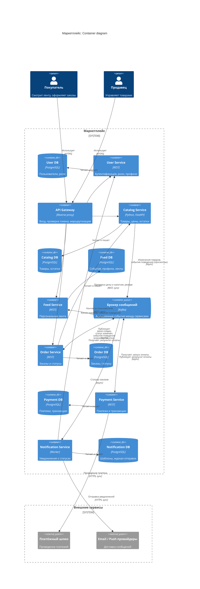

# Маркетплейс: архитектура (ДЗ-1)

Бизнес-логика не реализуется. В репозитории: описание архитектуры, C4 Container диаграмма и один сервис (Catalog) с `/health`, запускаемый в Docker.

## 1. Домены и зоны ответственности

| Домен | За что отвечает |
|---|---|
| Users | Регистрация и аутентификация, роли покупатель/продавец, профили, данные продавцов |
| Catalog | Товары, категории, цены, остатки; управление каталогом продавцами |
| Feed | Персональная лента: учёт поведения пользователя и ранжирование товаров |
| Orders | Оформление заказа, корзина, жизненный цикл и статусы заказа |
| Payments | Расчёт суммы, проведение платежей и возвратов, учёт транзакций, выплаты продавцам |
| Notifications | Уведомления покупателям и продавцам о статусах заказов |

## 2. Распределение доменов по сервисам

Один домен соответствует одному сервису, плюс API Gateway как инфраструктурный компонент без доменной логики.

| Сервис | Домен |
|---|---|
| API Gateway | нет (единая точка входа, проверка токена, маршрутизация) |
| User Service | Users |
| Catalog Service | Catalog |
| Feed Service | Feed |
| Order Service | Orders |
| Payment Service | Payments |
| Notification Service | Notifications |

Логика разбиения: границы проходят по бизнес-возможностям; профили нагрузки разные (Feed читается постоянно и терпит устаревание, Payments требует строгой консистентности); платежи и персональные данные изолированы по безопасности; уведомления вынесены, чтобы не стоять на критическом пути заказа.

## 3. Владение данными и взаимодействие

### Данные

У каждого сервиса своя база, общих баз нет. Чужие данные доступны только через API сервиса-владельца или через события.

| Сервис | Владеет данными |
|---|---|
| User Service | пользователи, роли, профили продавцов |
| Catalog Service | товары, категории, цены, остатки |
| Feed Service | события поведения, профили интересов, копия товаров для ранжирования, готовые ленты |
| Order Service | заказы, позиции, корзины, история статусов |
| Payment Service | платежи, транзакции, возвраты |
| Notification Service | шаблоны, журнал отправок |

### Взаимодействия

| Откуда | Куда | Тип | Зачем |
|---|---|---|---|
| Клиенты | API Gateway | sync (HTTPS) | единая точка входа |
| API Gateway | User, Catalog, Feed, Order | sync (REST) | запрос пользователя требует немедленного ответа |
| Order | Catalog | sync (REST) | при оформлении нужны актуальные цена и наличие, резерв остатков |
| Catalog | Feed | async (брокер) | обновить копию товаров, по которой строится лента; передать события поведения (просмотры карточек товаров) |
| Order | Feed | async (брокер) | передать события поведения (добавление в корзину, оформление и оплата заказа) для персонализации |
| Order | Payment | async (брокер) | запустить оплату созданного заказа |
| Payment | Order | async (брокер) | сообщить результат оплаты, чтобы заказ сменил статус |
| Order | Notification | async (брокер) | уведомить о смене статуса |
| Notification | User | sync (REST) | получить контакты пользователя (email, push-токен) для отправки |
| Payment | платёжный шлюз | sync (HTTPS) | провести платёж во внешней системе |
| Notification | email/push-провайдер | sync (HTTPS) | доставить сообщение |

Правило выбора: синхронно, когда ответ нужен пользователю или проверке прямо сейчас; асинхронно, когда реакция может подождать или нельзя связывать доступность сервисов. Для надёжности асинхронных событий используется transactional outbox и идемпотентные получатели.

Сценарий оформления заказа: покупатель отправляет заказ через Gateway в Order; Order синхронно проверяет цены и остатки в Catalog; Order создаёт заказ в статусе «ожидает оплаты» и публикует событие; Payment проводит платёж и публикует результат; Order переводит заказ в «оплачен» или «отменён» (с освобождением резерва); Notification информирует пользователя о каждой смене статуса.

## 4. C4 Container диаграмма



## 5. Альтернативные варианты декомпозиции

### A. Модульный монолит

Один деплой, одна БД, модули по доменам внутри приложения.

Плюсы:
- простая разработка и отладка, один процесс;
- не нужно синхронизировать контракты взаимодействия между сервисами;
- локальные ACID-транзакции между доменами, нет рисков потери сетевой связности и нет задержек из-за сети и (де)сериализации;
- минимум затрат на организацию инфраструктуры.

Минусы:
- масштабируется только целиком: нагрузку на ленту нельзя масштабировать отдельно от платежей;
- сбой или утечка памяти в любом модуле роняет всё приложение, включая работу с заказами и оплатой;
- единый релиз и единый стек, больше рисков конфликта зависимостей (например, рефакторинг при обновлении мажорной версии фреймворка нельзя проводить независимо);
- платёжный контур нельзя изолировать по безопасности;
- со временем границы модулей размываются.

### B. Микросервисы с общей БД

Сервисы по доменам, но все работают с одной общей базой данных.

Плюсы:
- транзакции между доменами остаются локальными;
- проще запросы, объединяющие данные нескольких доменов;
- проще начальная инфраструктура, чем у варианта C.

Минусы (с точки зрения отказоустойчивости):
- единая точка отказа: падение, failover или деградация БД останавливает все шесть доменов сразу, включая оплату и оформление заказа; независимая доступность сервисов теряется;
- нет изоляции нагрузки: тяжёлые запросы одного сервиса занимают соединения, CPU и IO и тормозят другие, деградация идёт каскадом;
- общий пул соединений и блокировки: долгая транзакция или миграция одной таблицы блокирует чужие сервисы;
- связность через схему: изменение таблицы ломает чужие сервисы, релизы приходится согласовывать, независимый деплой невозможен;
- большой радиус поражения: баг или неудачная миграция одного сервиса может испортить данные другого, а восстановление из бэкапа откатывает все домены сразу;
- нельзя выбрать хранилище под задачу (Redis для ленты, реляционная БД для платежей) и масштабировать домены независимо;
- платёжные данные нельзя изолировать на уровне хранилища.

### C. Микросервисы по доменам, БД на сервис (выбран)

Плюсы:
- независимое масштабирование (лента отдельно от платежей);
- изоляция отказов: сбой Feed или Notifications не останавливает оформление заказа;
- у каждого сервиса своя БД, подходящая под задачу; платёжные данные изолированы;
- независимые релизы и команды.

Минусы:
- eventual consistency между сервисами;
- тем не менее нужно делать упор на консистетность. Нет единой транзакции (атомарной) на несколько сервисов: оформление заказа затрагивает несколько сервисов и логику или необходимость отката надо продумывать отдельно (чтобы не было неконсистентных изменений в Catalogs после сбоя в Payments или Orders при оформлении заказа, например);
- больше эксплуатационной работы: вместо одного приложения нужно разворачивать и обновлять шесть сервисов, их базы и брокер; следить за ними отдельно; а чтобы понять, где сломался запрос, который прошёл через несколько сервисов, нужно сквозное логирование и трассировка по общему идентификатору запроса;
- сетевые вызовы и их отказы нужно учитывать (таймауты, ретраи). При этом в реализацию включить гарантии идемпотентности.

## 6. Финальный выбор: вариант C

Выбран вариант C: микросервисы по доменам с отдельной БД на сервис.

Так мы можем масштабировать приложения независимо и не делить ресурсы между приложениями неявно (позволяя, например, очереди нотификаций съесть все ресурсы). Это еще и безопасность, в том числе так можно легко отнять у сервиса с моделью ранжирования рекомендаций доступ до платежей.

## 7. Запуск сервиса (Catalog)

Требуется Docker с Compose.

```bash
cd hw1_v2
docker compose up --build
```

Проверка в другом терминале:

```bash
curl -i http://localhost:8000/health
```

Ожидаемый ответ: `HTTP/1.1 200 OK` и тело `{"status":"ok"}`.

Остановка: `docker compose down`.
